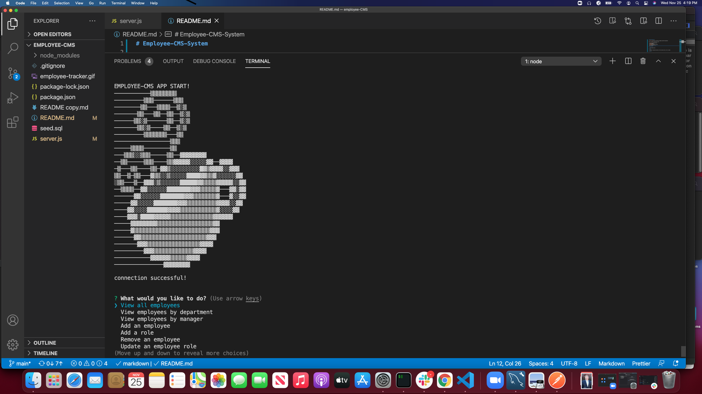

# Employee-CMS-System

This is a node.js app that uses a MySQL database to store information on an employee content management system. It is run the CLI and all user input prompts and data table outputs are viewed there as well.

Link to demo: https://drive.google.com/file/d/1wm_kQmdn3mH7WNq1qE-SGy2uvjmIRB8f/view
    
- [Installation](#installation)
- [Usage](#usage)
- [License](#license)
- [Contributions](#contributions)
- [Tests](#test)
- [Questions](#questions)
    
## Installation
(OSX/MAC)
    
1. Clone my github repo: https://github.com/204039643 to your local machine.
2. Navigate to respective directory where server.js file is located.
3. Install NPM packages inquirer, console.table, MySQL using NPM install.
4. Install a MySQL server to your machine and set up root access.
5. Start server using system preferences > MySQl, click on 'Start MySQL server'.
6. Execute SQL commands found in assets/seed.sql in your favorite GUI (I used MySQL workbench) or the MySQL cli directly to instantiate database and 3 data tables.
    
## Usage
    
1. Navigate to respective directory in the CLI where server.js file is located.
2. Start using 'node server.js' command in CLI.
3. Menu provide list of multiple user actions to be taken in SWL db (using CLI):
- View all employees 
- View employees by department 
- View employees by manager 
- Add an employee 
- Add a role 
- Remove an employee 
- Update an employee role 
- Quit
4. Each action is self explanatory and will either query and display output in tables or update dB as required.
5. Select 'quit' to exit app when finished.

## License
    
MIT
    
Copyright (c) [2020] Justin Sykes
    
Permission is hereby granted, free of charge, to any person obtaining a copy
of this software and associated documentation files (the "Software"), to deal
in the Software without restriction, including without limitation the rights
to use, copy, modify, merge, publish, distribute, sublicense, and/or sell
copies of the Software, and to permit persons to whom the Software is
furnished to do so, subject to the following conditions:
    
The above copyright notice and this permission notice shall be included in all
copies or substantial portions of the Software.
    
THE SOFTWARE IS PROVIDED "AS IS", WITHOUT WARRANTY OF ANY KIND, EXPRESS OR
IMPLIED, INCLUDING BUT NOT LIMITED TO THE WARRANTIES OF MERCHANTABILITY,
FITNESS FOR A PARTICULAR PURPOSE AND NONINFRINGEMENT. IN NO EVENT SHALL THE
AUTHORS OR COPYRIGHT HOLDERS BE LIABLE FOR ANY CLAIM, DAMAGES OR OTHER
LIABILITY, WHETHER IN AN ACTION OF CONTRACT, TORT OR OTHERWISE, ARISING FROM,
OUT OF OR IN CONNECTION WITH THE SOFTWARE OR THE USE OR OTHER DEALINGS IN THE
SOFTWARE.
    
## Contributions
    
- MySQL server and MySQL server workbench: (https://www.mysql.com/)
- NPM packages: Inquirer (https://www.npmjs.com/package/inquirer), Console.table (https://www.npmjs.com/package/console.table), MySQL (https://www.npmjs.com/package/mysql)
    
## Tests
    
None
    
## Questions?
Please reach out to me at either of the following:
GitHub username: 204039643
Email: atlsykes1@att.net
    
    
 ---This README was generated using nice-readme-generator :-) ---